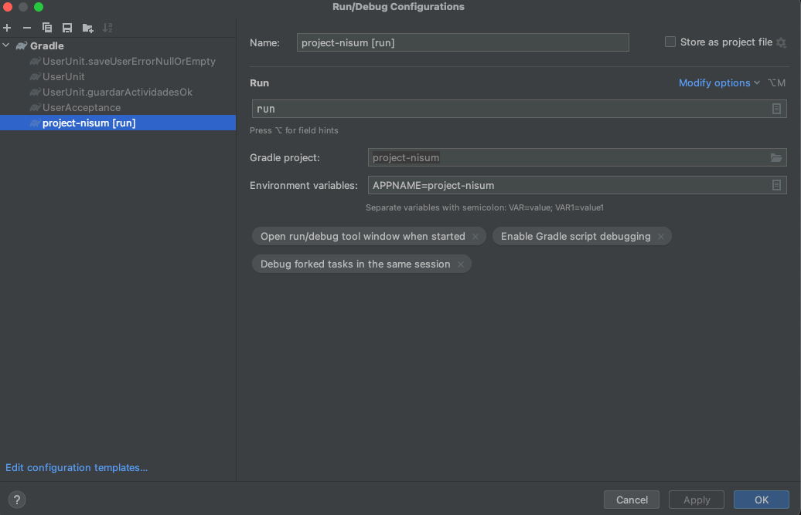

## Micronaut 2.3.2 Documentation

- [User Guide](https://docs.micronaut.io/2.3.2/guide/index.html)
- [API Reference](https://docs.micronaut.io/2.3.2/api/index.html)
- [Configuration Reference](https://docs.micronaut.io/2.3.2/guide/configurationreference.html)
- [Micronaut Guides](https://guides.micronaut.io/index.html)

---

## Feature http-client documentation

- [Micronaut HTTP Client documentation](https://docs.micronaut.io/latest/guide/index.html#httpClient)

## Ejecutar proyecto

-en gradle, project-nisum, expandir el menu de Tasks despues expandir application y ejecutar run.
despues de ejecutar run, editar la configuracion y agregar en environment las variables de entorno, las variables de
entorno estan en
application.yml estan al final del archivo comentadas. para las pruebas unitarias, ejecutar las pruebas unitarias y
editar la configuracion y agregar en environment las variables de entorno.

## Path y json

- http://localhost:8080/users-services/users

{
    "name": "jaime Rodriguez",
    "email": "jaime@rodriguez.org",
    "password": "ASFFAFD5a8ad$",
    "phones": [
        {
            "number": "1234567",
            "citycode": "1",
            "contrycode": "57"
        }
    ]   
}
``
## Arquitectura 

Lee el artículo [Clean Architecture — Aislando los detalles](https://medium.com/bancolombia-tech/clean-architecture-aislando-los-detalles-4f9530f35d7a)

## Application 
- Modulo de entrada a la aplicacion, es el encargado de ensamblar los otros modulos.

## Domain
- Se encarga de  encapsular la lógica y reglas del negocio mediante modelos y entidades del dominio, sin hacer validaciones, solo el paso de informacion entre las capas.

## Infrastructure
- En este modulo se encuentra la logica de la aplicacion, se encarga de las conexiones a la base de datos y manejo de datos y validaciones.